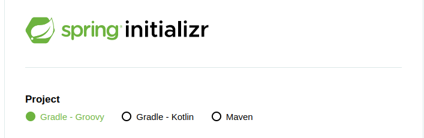
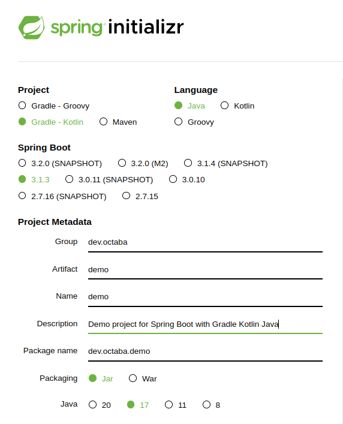

# prj-java
Este repositorio trata sobre java bueno estoy iniciando con java script.

Tratare de documentar todo lo que me pase en este sentido

Primero 
| O.S.     | Java     |  |
|----------|----------|----------|
| Ubuntu 22.04 jammy  | Cell 2   | Cell 3   |
| Row 2    | Cell 5   | Cell 6   |
| Row 3    | Cell 8   | Cell 9   |


## Download jdk
aunque en el sitio de https://spring.io/quickstart me recomienda que utilice Bellsoft Liberica JDK y al estar usando openjdk 17 . en el caso de linux eso se logra tan solo utilizando el siguiente comando

### Ubuntu
```bash
sudo apt update && sudo apt install default-jdk -y # Installs OpenJDK version of JDK
```
### Fedora
```bash
sudo dnf install java-17-openjdk* # Installs Oracle's JDK (Java Development Kit
```

Como resultado de esto es 


como se ve en el tutorial de spring boot al parecer me obliga a que utilice un build tool como son graddle o maven, entonces si que pienso que debemos instalarlo antes.



## Gradle install
Como se los habia mencionado estoy en ubuntu, bueno aqui nos dice que graddle es una herramienta de construccion de proyectos de codigo 

Nos recomienda que instalemos un SDKMAN que es un administrador de paquetes para graddle, pues le voy a hacer caso, quien soy yo para oponerme.

```bash
$ curl -s "https://get.sdkman.io" | bash
```
```bash
$ sdk install gradle
```

Para este repo el primer ejemplo es hecho con spring-gradle y kotlin sus principales protagonistas ademas de java.





